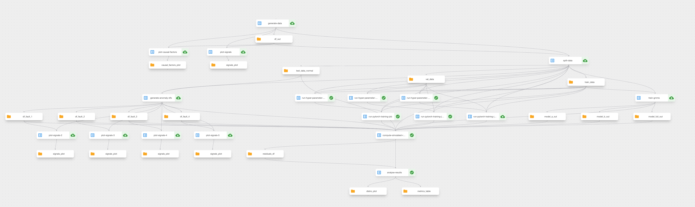
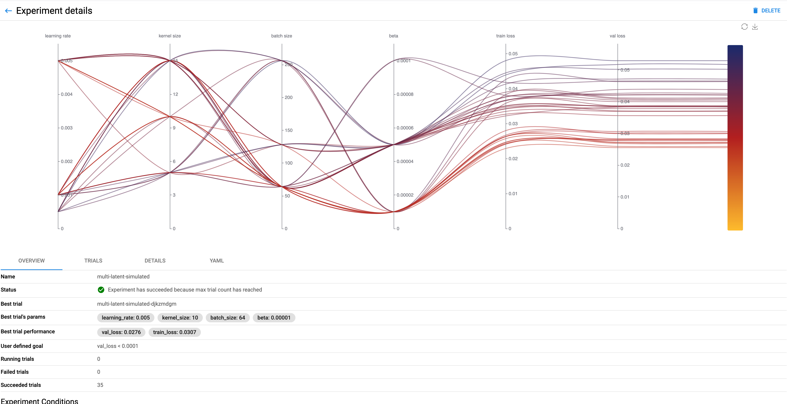
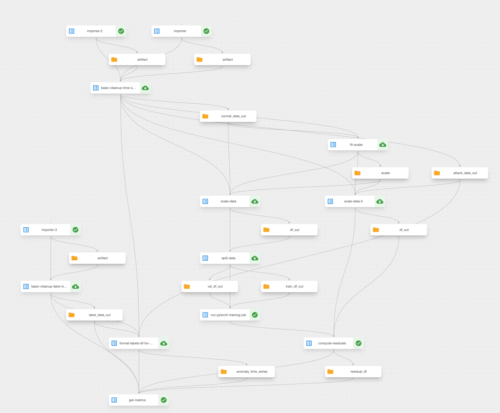

# Experiments for diagnosis driven anomaly detection paper

This repository contains the code and all parameters for the experiments
conducted for the paper "Diagnosis-Driven Anomaly Detection"
authored by Lukas Moddemann, Alexander Diedrich, Jonas Ehrhard, my boss Oliver Niggemann, and myself.
A special thanks to my colleagues.

### Paper abstract
In Cyber-Physical Systems (CPS) research, anomaly detection---detecting non-normal behavior---and diagnosis---identifying the underlying root cause---are often treated as distinct, isolated tasks. 
However, diagnosis algorithms require symptoms, i.e. temporally and spatially isolated anomalies, as input. 
Thus, anomaly detection and diagnosis must be developed together to provide a holistic solution for diagnosis in CPS. 
We therefore propose a method for utilizing deep learning-based anomaly detection to generate inputs for CBD. 
We introduce a novel deep neural network architecture that is designed to isolate anomalies in CPS temporally and spatially for subsequent usage in CBD.
We evaluate our approach on a simulated and a real-world CPS dataset, where our model demonstrates strong performance relative to other state-of-the-art models. 


## Overview
The main tools for experiment execution, tracking, and versioning in our analysis are provided by [Kubeflow](https://www.kubeflow.org/docs/started/introduction/).
For this paper, we used a Kubeflow instance hosted on-premises at our university.
The primary tool for experiment orchestration is  [Kubeflow Pipelines](https://www.kubeflow.org/docs/components/pipelines/)..
Additionally, we utilized [Kubeflow Notebooks](https://www.kubeflow.org/docs/components/notebooks/) for exploratory analysis, [Katib](https://www.kubeflow.org/docs/components/katib/) for hyperparameter tuning, and [Training Operators](https://www.kubeflow.org/docs/components/training/) for multi-GPU neural network trainings.


## Project structure
```txt
.
├── README.md
├── images --> Holds the code for the image used in containerized KFP components
│   └── diag-driven-ad-models
│       ├── Dockerfile
│       ├── README.md
│       ├── diag_driven_ad_models
│       ├── main.py
│       ├── ...
├── notebooks --> Holds notebooks for exploratory analysis
│   ├── 01_swat_data_exploration.ipynb
│   ├── ...
└── pipelines --> Holds code to create and run KFP pipelines
    ├── common_components.py --> Component definitions used in both experiments
    ├── constants.py --> Constants used in the pipeline definition
    ├── simulated_components.py --> KFP components used for the experiment on simulated data
    ├── simulated_pipeline.py --> KFP pipeline for simulated data
    ├── swat_components.py --> KFP components used for the experiment on SWAT data
    └── swat_pipeline.py --> KFP pipeline for SWAT experiment
```


## KFP Pipeline for the Experiment on Simulated Data

The primary experiment in our paper involves simulated data.
The first step of this experiment is to simulate data, as depicted in the pipeline visualization below:

The pipeline also triggers the hyperparameter tuning.
The following picture shows the result visualization of the hyperparameter tuning for one of the models we compare in our study.


The steps in the pipeline are as follows:

1. Generate Data: Creating the initial simulated dataset.
2. Split Data: Dividing the dataset into training and testing sets.
3. Run Hyperparameter Tuning: Optimizing model parameters for best performance.
4. Train Models: Training our proposed model as well as benchmark models.
5. Create Anomaly Samples: Generating samples with anomalies for testing.
6. Run Inference: Applying the models to the healthy test set and anomaly samples.
7. Analyse Results: Evaluating and interpreting the performance of the models.

Additional tasks within the pipeline are dedicated to plotting and further analysis.
Steps 3, 4, and 6 are executed in parallel for the different models we train,
including our proposed solution and the benchmark models.


### How to Reproduce

To reproduce the experiments, ensure you have a Kubeflow instance running. During our analysis, we used the following versions:

- **Kubeflow Version:** 1.7
- **Kubernetes Version:** 1.24
- **KFP Version:** 2.0.1
- **Python Version:** 3.9

For the training phase, we utilized 3 GPUs, including one NVIDIA A100 and two NVIDIA A40s.

The pipeline itself is composed and compiled in the `./pipelines/simulated_pipeline.py` file.
This Python module also triggers the execution of the pipeline.
Most steps in our pipeline utilize lightweight components, which are defined in the `./pipelines/simulated_components.py` module. 

However, for tasks such as model training and hyperparameter tuning, we employ a custom image.
This image is defined in the `./images/` directory of this repository.
You can find instructions for building and running your own image in the corresponding README within that directory.
Alternatively, the image we used is available on [Docker Hub](https://hub.docker.com/repository/docker/hsteude/diag-driven-ad-models/tags?page=1&ordering=last_updated).
The path to this image is hardcoded into our pipeline and component definitions.

## KFP Pipeline for the SWaT Data Experiment

The experiment with the SWaT dataset is structured similarly and is also conducted as a KFP pipeline.
The difference lies in our goal to examine if our model achieves good performance in general anomaly detection compared to the benchmark models mentioned in the paper by Garg et al., titled "An Evaluation of Anomaly Detection and Diagnosis in Multivariate Time Series" (IEEE Trans Neural Netw Learn Syst, Aug. 2021).

Like in the simulated data experiment, the pipeline is defined in the Python module `./pipelines/swat_pipeline.py`, and the lightweight components are in the module `./pipelines/swat_components.py`.



Unlike the experiment with simulated data, this experiment requires prior upload of the SWaT dataset to MinIO.
The dataset is introduced in the paper titled "A Dataset to Support Research in the Design of Secure Water Treatment Systems" by Goh et al., presented in Critical Information Infrastructures Security, Springer International Publishing, 2017.
Instructions for downloading the data are available [here](https://itrust.sutd.edu.sg/itrust-labs_datasets/dataset_info/).

Paths to the individual files are input parameters to the KFP pipeline, as shown in the code below:

```python
# define pipeline
@dsl.pipeline
def diag_tcn_swat_pipeline(
    normal_data_path: str = "minio://swat-dataset/SWaT.A1 _ A2_Dec 2015/Physical/SWaT_Dataset_Normal_v1.xlsx",
    attack_data_path: str = "minio://swat-dataset/SWaT.A1 _ A2_Dec 2015/Physical/SWaT_Dataset_Attack_v0.xlsx",
    label_data_path: str = "minio://swat-dataset/SWaT.A1 _ A2_Dec 2015/List_of_attacks_Final.xlsx",
    detrend_window: int = 10800,
    seed: int = 42,
    seq_len: int = 500,
    ...
```
As in the experiment with simulated data, we use the same hardware, software, and the Kubeflow PyTorch training operator for parallel model training using the DDP (Data Distributed Parallel) algorithm.
The detailed calculation of the model's score can be found in the lightweight components definition.
We primarily use a detrended version of the MSE value of the decoder for all signals to calculate the optimal composite F1 score as described in the paper by Garg et al.

If you  have further question to this code, don't hesitate to reach out to us!
